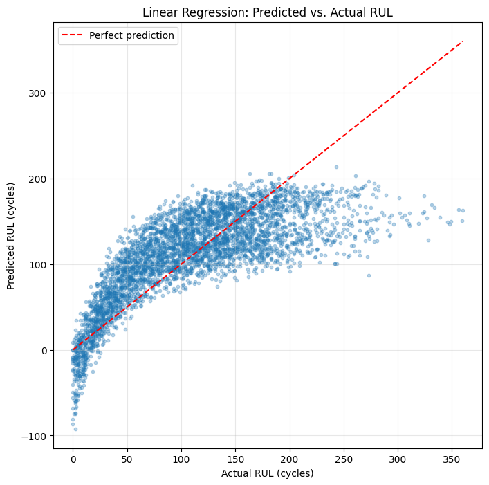
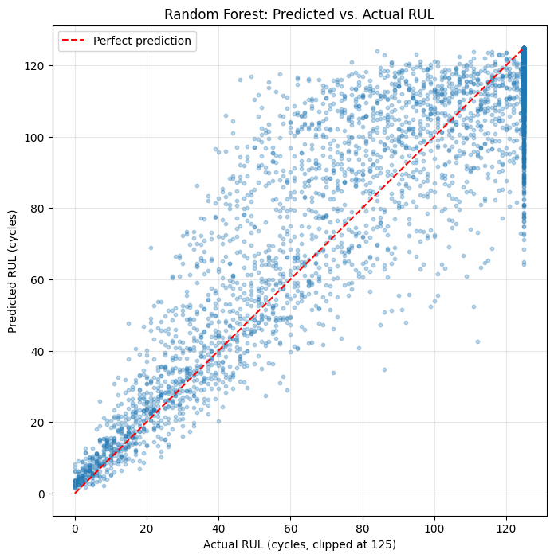

**Predicting Remaining Useful Life of Turbofan Engines using Sensor Data**

Predicting how many operating cycles a jet engine has left before failure, using NASA's turbofan engine sensor dataset — a classic predictive maintenance problem applied with machine learning.

**The Problem**

Unplanned equipment failure is expensive — in aviation, manufacturing, and industrial operations alike, an unexpected breakdown costs far more than a scheduled repair. Predictive maintenance flips this: instead of fixing machines on a calendar or waiting for them to break, sensor data is used to estimate how much useful life a machine has left, so maintenance can be scheduled right before it's needed — not too early (wasting good parts) and not too late (risking failure).

This project builds a model that does exactly that for jet engines: given a snapshot of an engine's current sensor readings, predict its Remaining Useful Life (RUL) — how many more operating cycles it has before it fails.

**The Data**

[NASA's CMAPSS Turbofan Engine Degradation dataset](url) (FD001 subset):

100 engines, each run from healthy to failure
21 sensor readings + 3 operational settings recorded at every cycle
~20,600 total rows across all engines
Single operating condition, single fault mode (the simplest of the four CMAPSS subsets)

**Approach**

1. Load and clean the data — no missing values, but several sensors were completely flat (zero variation) across all 100 engines and provided no usable signal; these were dropped.
2. Engineer the target — the raw data has no "cycles remaining" column. Since every engine runs to failure, RUL was calculated for every row as (engine's final cycle) − (current cycle).
3. Baseline model — Linear Regression, to establish a reference point.
4. Upgrade to Random Forest — to capture the non-linear, interacting relationships between sensors and degradation that a straight-line model can't.
5. Fix data leakage — the initial train/test split was done by row, which let the model see partial histories of engines it was later "tested" on. Rebuilt the split by engine instead, so the test set contains 20 engines the model never saw in any form during training.
6. Reframe the target (RUL clipping) — early in an engine's life, sensors show almost no wear, so precise RUL prediction is unrealistic and not particularly useful. Following standard practice on this dataset, RUL was clipped at 125 cycles, refocusing the model on the "approaching failure" zone where predictions actually matter for maintenance decisions.

**Results**

**Model	                              Split	                MAE (cycles)**
Linear Regression	                  By engine (honest)	  30.13
Random Forest	                      By engine (honest)	  26.02
Random Forest (RUL clipped at 125)	By engine (honest)	  12.58

Random Forest consistently outperformed Linear Regression, and reframing the problem around the failure-approach zone (clipping) roughly halved the error again — the model went from being off by nearly a month of operating cycles to being off by less than two weeks, in the range that actually matters for scheduling maintenance.

**Key Finding: What the Model Actually Relies On**

Checking Random Forest's feature importances showed sensor_11 as the dominant predictor, responsible for over 40% of the model's decision-making — more than three times the next most important sensor. This is the same sensor that showed a clear noisy-but-rising trend when manually plotted for a single engine during exploration, so the model's own reasoning lined up with what was visible by eye.

Notably, op_setting_3 — one of the three operational settings — carried zero importance, consistent with FD001 being the single-operating-condition subset of this dataset.

**Visuals**

Linear Regression: Predicted vs. Actual RUL — predictions flatten out and underestimate badly for engines with a lot of life left, and some predictions dip below zero (physically impossible).
 

Random Forest (clipped): Predicted vs. Actual RUL — predictions track the actual value far more tightly, especially in the failure-approach zone, with no negative predictions.
 

**Honest Limitations**

**This is FD001 only** — the simplest of the four CMAPSS subsets (one operating condition, one fault mode). The harder subsets (FD002–FD004) involve multiple operating conditions and fault modes, and would need a different approach.
**The model still shows some optimistic bias** — in a maintenance context, an optimistic miss (predicting more life left than actually exists) is riskier than a pessimistic one, since it risks running a machine past its true failure point.
**The row-vs-engine leakage issue was caught and fixed during this project** — an earlier version of this model (row-based split) reported a better-looking but dishonest MAE of ~29.6 cycles, before the split was corrected.

**How to Run**

The full analysis was built in Google Colab: 
